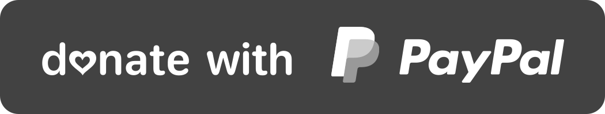

### Hi there 👋

#### I'm a Sr. Full-Stack Java Developer In Jordan.

- 🔭 I’m currently working on web and mobile applications using Java (With [Play Framework](https://www.playframework.com/), [Ebean](https://ebean.io/)) and Angular (And Ionic).
- 👯 I’m looking to collaborate on Java and Angular open source projects and plugins.
- 🤔 I’m looking for help with everything  😅
- 💬 Ask me about anything but answer is not guranteed 😁.
- 📫 How to reach me: <a href="https://www.linkedin.com/in/almothafar/">LinkedIn</a>
- ⚡ Fun fact: I love games when I'm busy, not motivated to play any game when I'm free or bored 😂
- 💻 My favorite IDE is IntelliJ IDEA Ultimate and I hate Dark mode 🌒 in general

  

  
    
  

  <i>Reach out at:</i>

  

    
    
  

  

    If you think I helped you somehow, or you just feeling generous, I like coffee ☕
     
  

<!--
**almothafar/almothafar** is a ✨ _special_ ✨ repository because its `README.md` (this file) appears on your GitHub profile.

Here are some ideas to get you started:

- 🔭 I’m currently working on ...
- 🌱 I’m currently learning ...
- 👯 I’m looking to collaborate on ...
- 🤔 I’m looking for help with ...
- 💬 Ask me about ...
- 📫 How to reach me: ...
- 😄 Pronouns: ...
- ⚡ Fun fact: ...
-->
